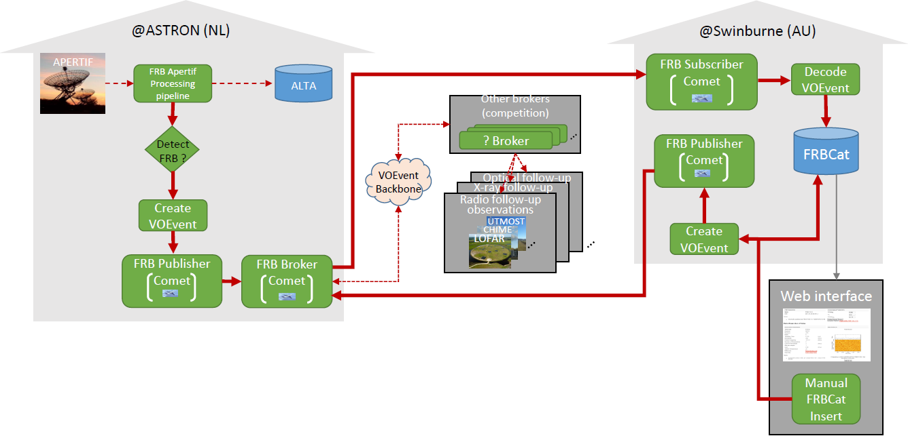

# AA-ALERT Access overview

After the starting meeting we have come up with the following AA-ALERT Access overview chart:

The FRB Apertif processing pipeline running in ASTRON is in charge of detecting FRBs from Apertif data.

When a FRB is detected, a VOEvent must be generated and sent to the VOEvent backbone
(a network where different entities can publish VOEvents and be subscribed to get notifications when VOEvents are published).

In Swinburne (Australia) a DB is in charge of storing a catalog of FRB events (detected by the FRB Apertif processing pipeline but also other relevant events)

For FRB Brokers and publishers we use Comet (https://github.com/jdswinbank/Comet/). There is currently a Comet running in ASTRON acting as Broker (FRB Broker in figure). This means it is running with the --receive and the --broadcast flags (so also has both roles of Publisher and Subscriber), and if we want to hook the ASTRON Comet with competition brokers it is as easy as adding the other brokers with --remote options. Then, the ASTRON Comet (via its subscriber role) will also get other VOEvents from other brokers and we can add filters to only handle the ones we want. I think all this is trivial but we can worry (ask Mike Sipior) about this later anyway.

The “FRB publishers” (one in ASTRON and one in Swinburne) are trivial too (once we have a valid VOEvent XML). We just need to use the comet-sendvo tool of Comet.

The “FRB Subscriber” in Swinburne must be developed and we have to start forking and extending Comet with event handlers (http://comet.transientskp.org/en/stable/handlers.html)

The “Create VOEvent” and the “Decode VOEvent” are essentially to convert to/from VOEvents-XML-format <-> FRBCatDB-friendly-fields.

The web tool “Manual FRBCat Insert” needs to be developed. This is to add FRB in the DB and to create (and publish) VOEvent related to it

We also want to improve the DB browsing experience but this is for later.

For now, the most important things are the “Create VO Event” and the “Decode VOEvent”, i.e. to go from VOEventXML to FRBCat-friendly-fields and viceversa. This is required by most of the components - “FRB publishers”, “FRB Subscriber” and “Manual FRBCat Insert”.
